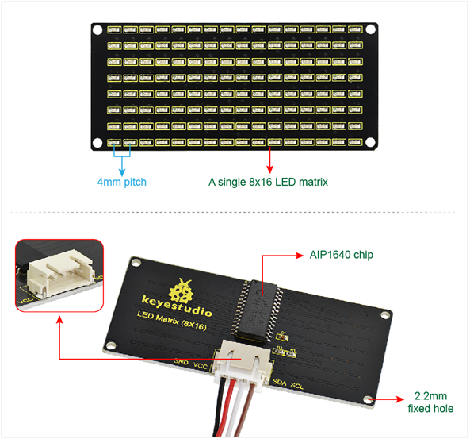

# Keyestudio-8x16-LED-Matrix-Panel-Drive
Keyestudio 8x16 LED Matrix Panel Drive Micropython (AIP1640)



## Usage：
```
import machine
import time

# 引脚定义 (根据实际硬件连接修改)
IIC_SCL = machine.Pin('A5', machine.Pin.OUT)  # 根据实际硬件调整引脚
IIC_SDA = machine.Pin('A6', machine.Pin.OUT)  # 根据实际硬件调整引脚

# 初始化变量
data_line = 0
delay_count = 0

# 显示数据表 (4个16字节的图案)
table = [
    [0x00,0x00,0x00,0x00,0x26,0x41,0x86,0x80,0x80,0x80,0x86,0x41,0x26,0x00,0x00,0x00],
    [0x00,0x00,0x00,0x00,0x00,0x1C,0x22,0x42,0x84,0x42,0x22,0x1C,0x00,0x00,0x00,0x00],#爱心动画（数据二进制，从远离端口的LED开始点亮，1亮0灭）
    [0x00,0x00,0x00,0x00,0x20,0x44,0x42,0x84,0x80,0x84,0x42,0x44,0x20,0x00,0x00,0x00],
    [0x00,0x00,0x00,0x00,0xC0,0x40,0xF8,0xD8,0x7E,0xFF,0xC0,0x00,0x00,0x00,0x00,0x00]
]

# I2C起始信号
def IIC_start():
    IIC_SCL.value(0)
    time.sleep_us(3)
    IIC_SDA.value(1)
    time.sleep_us(3)
    IIC_SCL.value(1)
    time.sleep_us(3)
    IIC_SDA.value(0)
    time.sleep_us(3)

# I2C发送一个字节
def IIC_send(send_data):
    for i in range(8):#更新8行数据
        IIC_SCL.value(0)
        time.sleep_us(3)
        IIC_SDA.value(1 if (send_data & 0x01) else 0)
        time.sleep_us(3)
        IIC_SCL.value(1)
        time.sleep_us(3)
        send_data >>= 1

# I2C停止信号
def IIC_end():
    IIC_SCL.value(0)
    time.sleep_us(3)
    IIC_SDA.value(0)
    time.sleep_us(3)
    IIC_SCL.value(1)
    time.sleep_us(3)
    IIC_SDA.value(1)
    time.sleep_us(3)


# 设置地址自动递增模式
IIC_start()
IIC_send(0x40)
IIC_end()
# 主循环

# avb=1
# if avb:# 设置亮度
IIC_start()
IIC_send(0x8A)
IIC_end()


while True:
    # st=time.ticks_us()
    # 发送显示数据
    IIC_start()
    IIC_send(0xC0)  # 设置起始地址
    
    for i in range(16):#更新16列数据
        IIC_send(table[data_line][i])#一次传递一个数据如0x1C
    
    # 更新显示图案
    delay_count += 1
    if delay_count >= 10:
        delay_count = 0
        data_line = (data_line + 1) % 4  # 循环切换4个图案
    
    IIC_end()

    time.sleep_ms(100)  # 延时100ms
```
